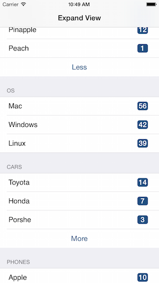

# ExpandTableView

iOS TableView with expanding and shrinking feature

## License

Source code of this project is available under the standard MIT license. Please see [the license file][LICENSE].
[LICENSE]:https://github.com/krishanthajayathilake/ExpandTableView/blob/master/LICENSE

### Screens

